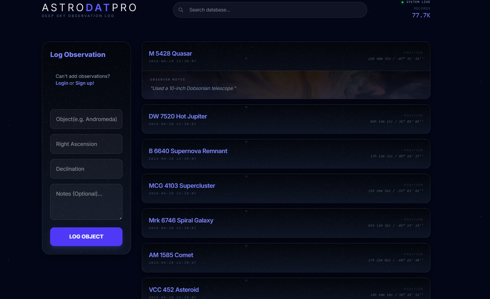
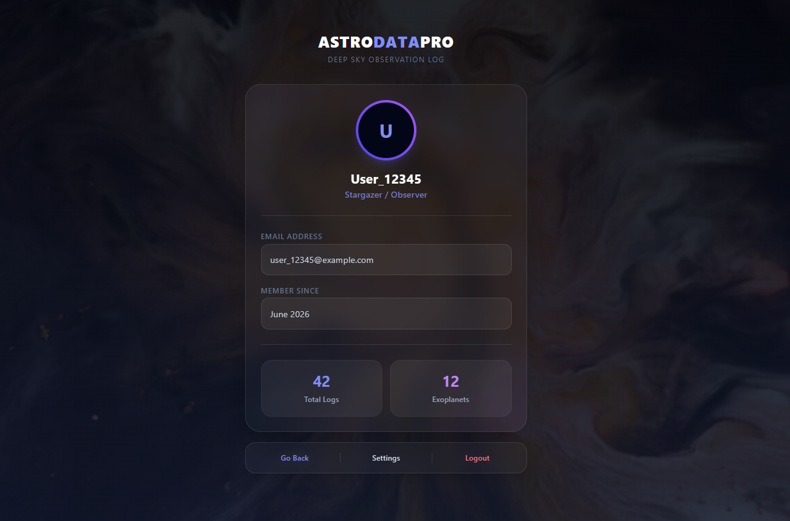
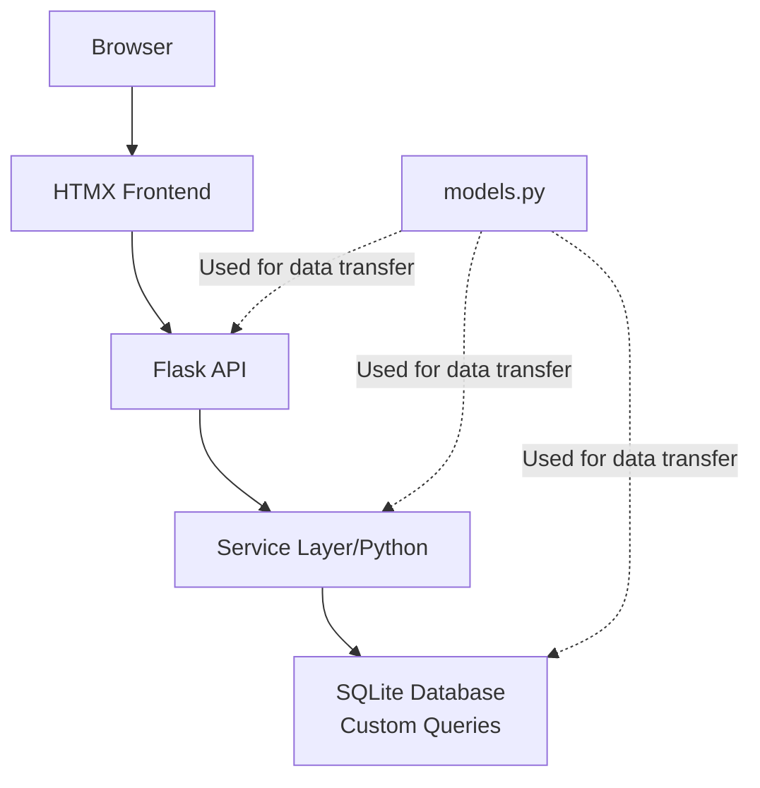
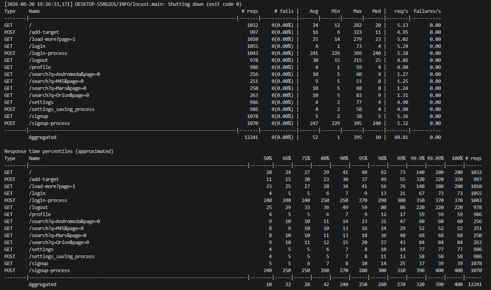

# AstroDat Website 🌌
> **Status:** Under Development

A Flask-based web application for archieving and managing astronomical observations.  
The system focuses on proper data handling, validation of celestial coordinates, and efficient display of large datasets using **HTMX**.


---




## Technologies
* Python
* Flask
* SQLite
* HTMX
* Tailwind CSS
* Jinja2
* JavaScript
* Locust

## Core Features
* User Authentication & Session Management
* Astronomy Observation Logging
* Search & Pagination
* Infinite Scrolling
* User Profiles & Statistics
* Real-time Validation
* Responsive UI

## System Architecture
The application follows a **Layered Architecture** pattern to ensure a clear **Separation Of Concerns**.


### Backend (Python / Flask)
* **`app.py` (Controller):** Handles routing and endpoints. Responsible for rendering Jinja2 templates and HTMX fragments.
* **`AstroService.py` (Business Logic):** Performs data validation and acts as an intermediary between the Controller and Data Access Layer.
* **`AstroDatabase.py` (Data Access Layer):** Handles SQL queries on the SQLite database.
* **`models.py`:** Defines data classes used to structure data across layers.

### Frontend (Modern Stack)
* **HTMX:** Enables dynamic requests without full page reloads (AJAX-like behavior).
* **Tailwind CSS:** Responsive design and modern UI styling.
* **Jinja2:** Server-side templating for dynamic HTML rendering.

---

## UX & Data Flow
* **Live Search:** On each keystroke (with debounce), HTMX sends a GET request to /search and updates the table dynamically
* **Optimistic Updates:** Insert (`POST`) and delete (`DELETE`) operations update the DOM immediately using returned HTML fragments (`target_row.html`).
* **Infinite Scroll:** Χρήση του `load_more_trigger.html` για αυτόματη φόρτωση δεδομένων όταν ο χρήστης φτάνει στο τέλος της λίστας.
* **Real-time Validation:** Το `coords.js` enforces formatting for celestial coordinates (RA/Dec) during input.

---

## Performance Testing
* Dataset Size: 70-80k records
* Concurrent Users: 100
* Failure Rate: 0%
* * Average Response Time: 52 ms
* Tool: Locust

---

## Bottlenecks

* **Performance:** For large-scale datasets, adding an **indexing** on target_name would improve query performance in SQLite.
* **Connection Management:** The current `_get_connection` method opens and closes a database connection per request. A future upgrade to `SQLAlchemy` is planned for connection pooling and improved scalability.
* **Error Handling:** Enhanced error handling is planned to return precise HTTP status codes for validation failures.
---

## Installation & Setup
   ```bash
   git clone [https://github.com/MarseloBogdani/AstroDatWebsite](https://github.com/MarseloBogdani/AstroDatWebsite)

   cd AstroDatWebsite

   # Create virtual environment (Windows)
   python -m venv venv
   venv\Scripts\activate

   # Install dependencies
   pip install -r requirements.txt

   # Run the application
   python app.py

   ```
---
### System Design Decisions
* **Architecture:** Layered approach (Controller → Service → DAO) for maintainability.
* **Tech Stack:** Flask + HTMX for lightweight, dynamic interactivity.
* **Database:** Raw SQL with SQLite for performance control and learning.
* **Logic & Data:** Service-layer validation and typed data models for robust data flow.
* **UX/Performance:** HTMX-driven pagination for smooth scrolling; validated with Locust (100 users).
* **Roadmap:** Planned transition to PostgreSQL, indexing, and * **SQLAlchemy connection pooling.
* **Error Handling:** Structured, centralized exception management.

---
Note: The frontend was developed with the assistance of AI tools.
All backend architecture, business logic, database design,
testing and optimization decisions were implemented **BY THE AUTHOR (me)** 